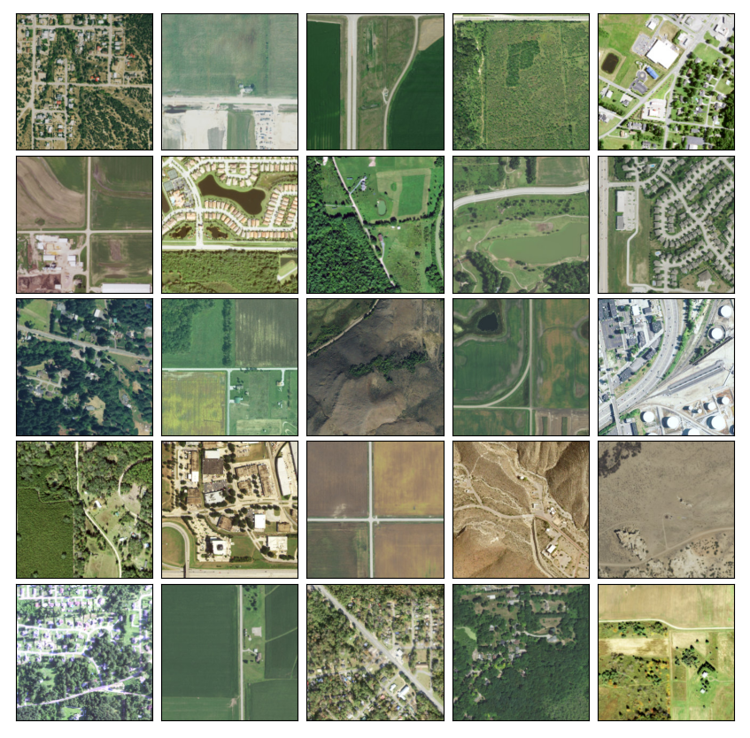
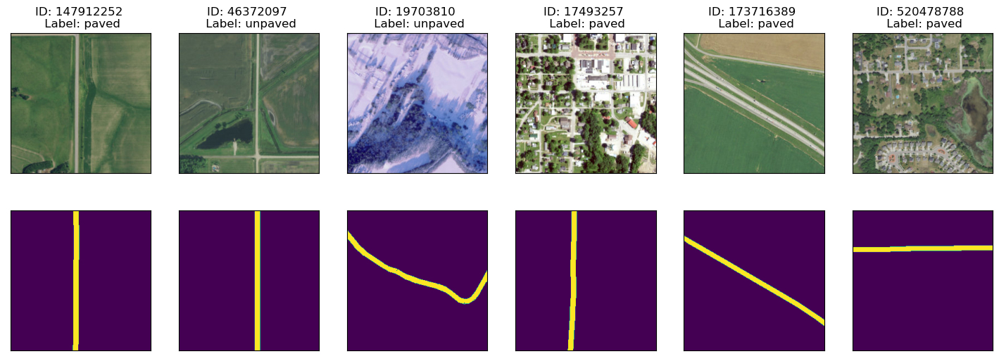
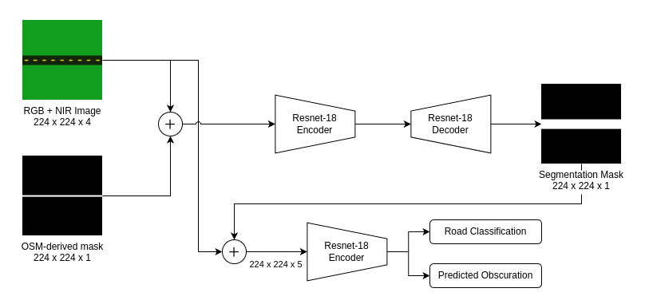
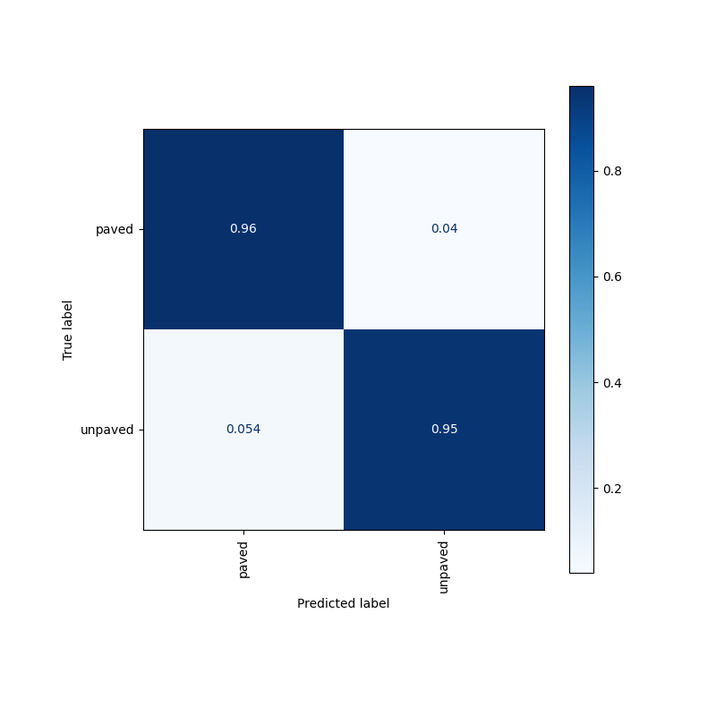
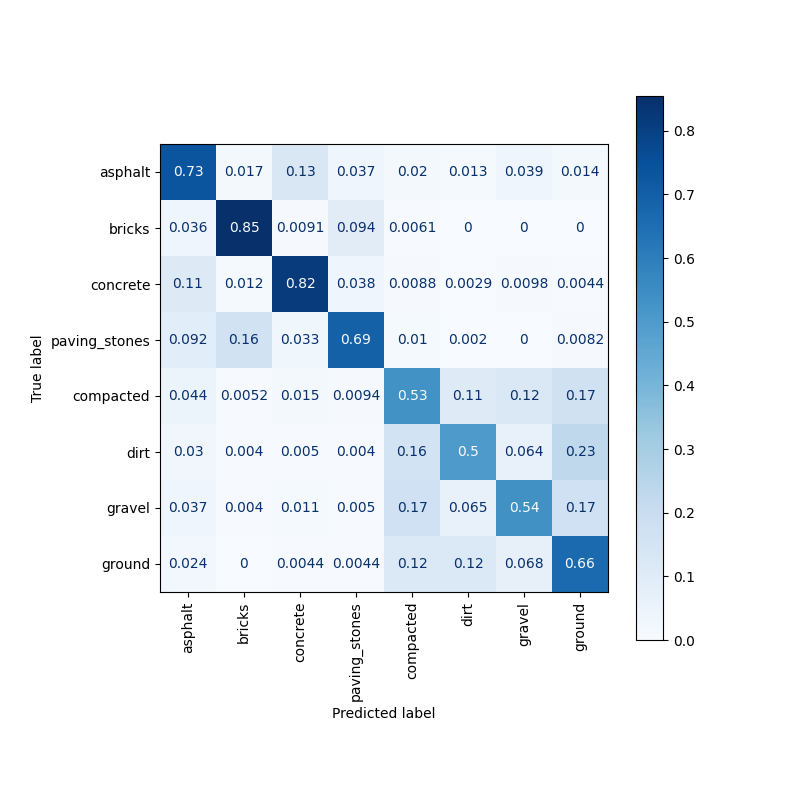

## Python Environment
I recommend [pip-tools](https://github.com/jazzband/pip-tools) to manage the environment for this project. The gist for to set up a Python environment for this repo would be:
```bash
$ cd /.../road_surface_classifier          # cd into project directory
$ python3 -m venv ./venv                   # create Python virtual env
$ . venv/bin/activate                      # activate env
(venv) $ python3 -m pip install pip-tools  # install pip-tools
(venv) $ pip-sync                          # automatically installs dependencies!
```

## Training Dataset
The dataset used in this project was prepared by the process outlined in [project notebooks](./notebooks). It is the aggregation of OpenStreetMap data w/ [National Agriculture Imagery Program (NAIP)](https://www.usgs.gov/centers/eros/science/usgs-eros-archive-aerial-photography-national-agriculture-imagery-program-naip) imagery, which is public domain. I additionally have a routine that generates pseudo-truth segmentation masks which the model learns to predict.

Currently the dataset has been automatically generated, but in some cases has issues related to the visibility of the roads due to vegetation growth (though the model is trained to predict this). Also of note is that there is no guarantee the labels set in OSM are correct, so we must trust that the vast majority of them are correct. A big source of confusion, for example, is asphalt vs. concrete. It would not surprise me if there are many mislabeled examples of these within OSM.


> :heavy_exclamation_mark: NAIP imagery is limited to the United States. While there are other public domain imagery sources that can be used, none have global coverage.

<figure>
  
  <figcaption>Examples of NAIP imagery over roads. These are Web Mercator tiles at zoom level 16 (~2.3 meters per pixel). However, the model is trained on raw NAIP data which includes NIR and is 1 meter per pixel. (<i>source: USGS National Agriculture Imagery Program</i>)</figcaption>
</figure>

To support the MaskCNN architecture (_see below_), binary masks were also generated in order to tell the model "where to look":

<figure>
  
  <figcaption>Examples of NAIP imagery over roads with OSM labels (paved vs. unpaved) and generated binary masks from OSM data. (<i>source: USGS National Agriculture Imagery Program [imagery]; OpenStreetMap [labels]</i>)</figcaption>
</figure>

## Model Architecture

I'm currently using a MaskCNN model largely based on [Liu et al.: _Masked convolutional neural network for supervised learning problems_](https://par.nsf.gov/servlets/purl/10183705).
  - Instead of multiplication, I concatenate the predicted mask into the classifier backbone.
  - I'm using a Resnet-18 backbone for both the encoder, decoder, and classifier.
  - By using such a small encoder, this can inference on a CPU!
<figure>
  
  <figcaption>Quick diagram of the MaskCNN architecture used here. The NAIP imagery gets combined with a mask created from OSM vector data, which in-turn is used to generate the segmentation mask. The image and segmentation mask are then fed into the classifier model.</figcaption>
</figure>

The benefit of this model over a plain Resnet is the ability to tell the model what the mask should look like. This tells the classifier "where to look" (i.e. I care about _this_ road in the image, not _that_ one).

The trick is to not force the appearance of this mask too much, because then (1) the model stops looking outside the mask after the concatenation step and (2) the model will care about the mask more than the classification result!

## Model Training

Training is currently done w/ [PyTorch Lightning](https://www.pytorchlightning.ai/), see [`train.py`](./model/train.py).

> :heavy_exclamation_mark: I don't recommend training this model without a dedicated compute GPU configured with CUDA. I know some use [Google Colab](https://colab.research.google.com/), but I'm unfamiliar.

## Training Results

**To read the confusion matrix**, for each box, read "when the true label is X, then __% of the time the models predicts Y".

### Paved vs. Unpaved

<figure>
  
  <figcaption>Not bad! The model gets each category right over 95% of the time.</figcaption>
</figure>

### Multiclass
<figure>
  
  <figcaption>Given the imagery resolution, often obscuration of vegetation, and often incorrect truth labels this is impressive. The model clearly shows skill in predicting a wider range of classes than just paved vs. unpaved.</figcaption>
</figure>

## Credits

#### MaskCNN Paper
Liu, L. Y. F., Liu, Y., & Zhu, H. (2020). Masked convolutional neural network for supervised learning problems. Stat, 9(1), e290.

## License
[MIT](https://choosealicense.com/licenses/mit/) &copy; 2024 Jonathan Dalrymple
